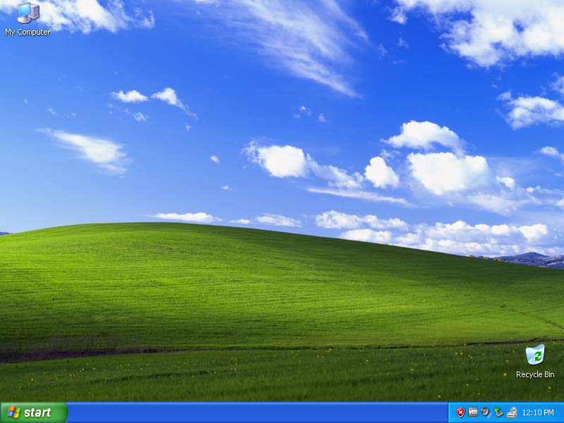

# Compatibility
The original game was written and compiled in 1999, which these days create some inconveniences, not to mention that newer compilers use modern runtime libraries, which also isn't great when attempting to run the new code on the old platforms, such as Windows XP. This document goes over developer and runtime configuration in order to be able to run the game on Windows XP.

## Watcom
Watcom C/C++ compiler was used back in the 90s and early 00's by a lot of games, including High Stakes. Even though it's long gone, there is [Open Watcom 2.0](https://github.com/open-watcom/open-watcom-v2) compiler, that runs perfectly fine on Windows XP and compiles code that is compatible out of the box.

### Requirements
1. [Open Watcom C/C++ Compiler](https://github.com/open-watcom/open-watcom-v2)

### Build & Use
1. Open projects under `Compatibility/Watcom`, a.k.a `wpj` files with Watcom IDE.
2. Compile the project.
3. Copy the compiled file, i.e. `dll` file into the game folder.
4. Enjoy!

## Microsoft Visual C++ 6

### Requirements
1. [Microsoft Visual C++ 6](https://archive.org/details/en_vs6_ent)
2. [Microsoft DirectX 6.0 SDK](https://archive.org/details/directx6sdk)
2. [Microsoft DirectX 7.0 SDK](https://archive.org/details/dx7sdk-7001)

### Build & Use
1. Install DirectX 6 SDK.
2. Copy `Include` and `Lib` folders from the SDK to `SDK/60`.
3. Install DirectX 7 SDK.
4. Copy `Include` and `Lib` folders from the SDK to `SDK/70`.
5. Open Visual Studio solution `AutoZone.dsw` under `Compatibility/MSVC6`.
6. Compile the solution.
7. Pick a file you need in the appropriate sub folder, rename appropriately, and copy to the game folder.
8. Enjoy!

## Thanks
1. [Archive.org](https://archive.org/) for providing [Microsoft Visual C++ 6](https://archive.org/details/en_vs6_ent), [Microsoft DirectX 6.0 SDK](https://archive.org/details/directx6sdk), and [Microsoft DirectX 7.0 SDK](https://archive.org/details/dx7sdk-7001).
2. [Open Watcom](https://github.com/open-watcom/open-watcom-v2) for providing the compiler.

## Legal
Need For Speed, Need For Speed: High Stakes, Windows, Visual Studio, Watcom, DirectX, OpenGL, Vulkan, and others are trademarks of their respective owners.
